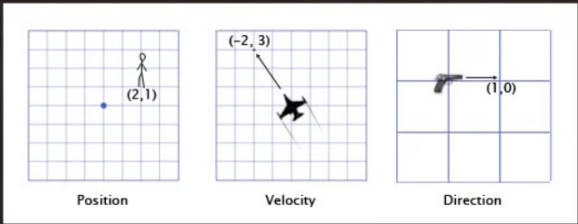
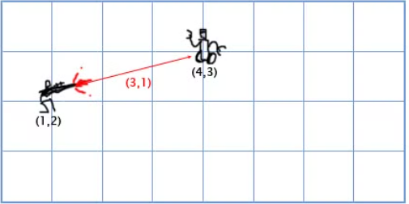
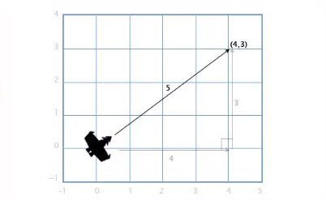

# Les vecteurs

Dans les jeux un vecteur est utilisé pour stocker une position, une direction et une vitesse dans un **espace donné**.

- Par exemple :
    
    
    
    

La position du vecteur indique que le personnage se situe à 2 mètre (ou autre) vers la droite et 1 mètre vers le haut

La vélocité montre qu’en 1 minute l’avion bouge de 3 (km) vers le haut et 2 km vers la gauche par rapport à l’origine

La direction du vecteur montre que le pistolet est orienté vers la droite
$\pagebreak$

### Addition de Vecteur

- Pour additionner des vecteur entre eux, il suffit d’ajouter chaque composant (vecteur) entre eux séparément.
    
Par exemple : 

(0, 1, 4) + (3, -2, 5) = (0 + 3, 1 - 2, 4 + 5) = (3, -1, 9)

Prenons l’exemple de Mario. Il commence à la position (0, 0). Il décide de sauté donc on applique a sa position une vitesse de (1, 3). 

$\pagebreak$

Une fois à la position (1,3) s’il n’y a pas de gravité/ frottement ou ce que vous voulez a appliquer sur l’accélération, Mario continuerai infiniment de monter de (1, 3) car la vitesse du vecteur resterai inchangé comme on peu le voir dans l’exemple ci dessous :

$\pagebreak$

Tout au long du saut son accélération est de (0, -1) car la gravité le pousse vers le bas mais toujours vers la droite. C’est pourquoi la vitesse suivante de Mario se (1, 2) car on application a sa vitesse l’accélération soit $\rightarrow$ v + a = (1, 3) + (0, -1) = (1 + 0, 3 - 1) = (1, 2). et ainsi de suite a chaque frame.

    
$\pagebreak$

### Soustraction de vecteur

Les soustraction de vecteur fonctionne de la même manière que les additions et également par frame. 

La soustraction de vecteur est souvent utilisé pour trouver le vecteur d’une position vers une autre.

Par exemple le joueur poster à la position (1, 2) avec le fusil laser et le robot situé en (4, 3) comme ci-dessous :

Pour retrouver le vecteur que le laser devra parcourir pour toucher le robot, on peut soustraire la position du joueur avec celle du robot.

(4, 3) - (1, 2) = (4 - 1, 3 - 2) = (3, 1)

### Vecteur scalaire multiplication

Quand on parle de vecteur, on désigne les nombre seul ( individuel) en tant que scalaire. 

Par exemple :

(3, 4) est un vecteur

5 est un scalaire

Dans les jeux, on utilise souvent un scalaire pour multiplier un vecteur comme par exemple pour simuler la résistance de l’air, on peut multiplier la vitesse du joueur par 0.9 à chaque frame. Pour faire cela, on multiplie simplement chaque composant du vecteur par le scalaire. 

Si le joueur a une vitesse de (10,20), la nouvelle vitesse sera :

0.9 * (10, 20) = (0.9 * 10, 0.9 * 20) = (9, 18)

- *Une fois l’introduction aux vecteurs faites, certains outils fondamentaux, nous serons utiles pour travailler avec eux à savoir la longueur, la normalisation, la distance, le produit de points et le produit en croix. Une fois ces concepts assimilés et que des fonctions pour les utiliser seront écrite, la résolution de la plupart des problèmes vectoriels sera plus simple*

### Longueur

Si nous avons un bateau avec un vecteur dont la vitesse est (4,3), nous pourrions vouloir connaitre sa vitesse afin de calculer par exemple le niveau de tremblement de l’écran ou bien sa consommation en essence. Pour savoir cela nous avons besoin de la longueur du vecteur V. La longueur d’un vecteur s’écrit en utilisant ||, on notera donc la distance de V → |V|

On admettra que V est un triangle rectangle ( voir exemple ci-dessous) avec pour côté 4 et 3 et utiliser le théorème de Pythagore pour trouver l’hypoténuse *x^2^ + y^2^ = h^2^*

Il s’agit de la longueur du vecteur H avec les composant (x, y) est $\sqrt{x^2 + y^2}$. 

Pour calculer la vitesse du bateau on utilise juste : 

|V| = $\sqrt{4^2 + 3^2}$ = $\sqrt{(25)}$ = 5

### Distance

Si le joueur P est en (3,3) et qu’il y a une explosion E en (1,2), nous avons besoin de trouver la distance entre le P et E pour voir combien de dommage le joueur prendra. Afin de trouver cela, il faudra combiner deux outils que l’on a déjà vu avant. la **soustraction** de vecteur et la **longueur. Il faut donc soustraire P-E pour trouver le vecteur entre eux et ensuite trouver la longueur de ce vecteur afin de récupérer la distance entre eux. L’ordre n’a pas d’importance ici, |E-P| nous donnera le même résultat.**

**Distance** = |P-E| = |(3, 3) - (1, 2)| = $\sqrt{(2^2 + 1^2)}$ = $\sqrt{(5)}$ = 2,23

### Normalisation

Lorsqu'il s'agit de la direction (par opposition à la position ou à la vitesse), il est important qu'ils aient une longueur unitaire (longueur de 1). Cela nous facilite grandement la tâche. Par exemple, supposons qu'un pistolet pointe dans la direction (1,0) et qu'il tire une balle à 20 m/S. Quelle est la vitesse : (20,0). Si le vecteur de direction avait une autre longueur, nous ne pourrions pas faire cela : la balle serait trop rapide ou trop lente.

Un vecteur de longueur 1 est dit « normalisé ». Comment normaliser un vecteur (fixer sa longueur à 1) ? Il suffit de diviser chaque composante par la longueur du vecteur. Si nous voulons normaliser le vecteur V avec la composante (3,4), il suffit de diviser chaque composante par sa longueur, 5, pour obtenir (3/5, 4/5). Nous pouvons maintenant utiliser le théorème de Pythagore pour prouver que le vecteur a une longueur de 1 :

$\frac{3}{5^2}$ + $\frac{4}{5^2}$ = $\frac{9}{25}$ + $\frac{16}{25}$ = $\frac{25}{25}$ =  1